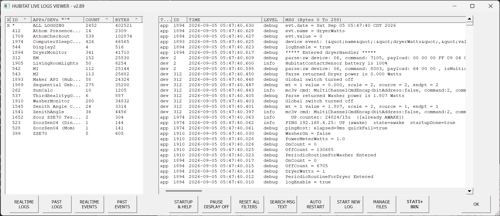
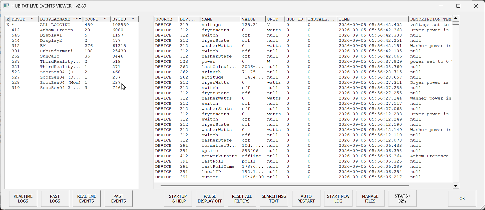
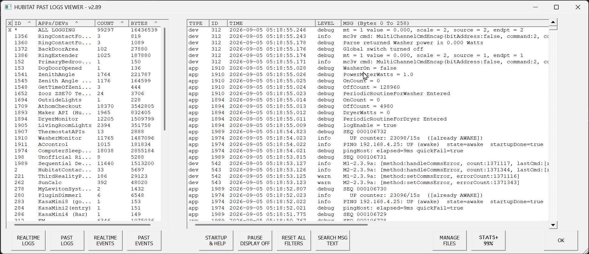
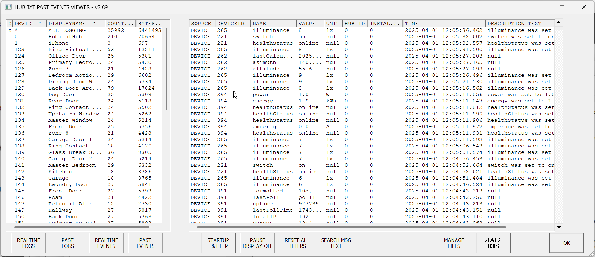
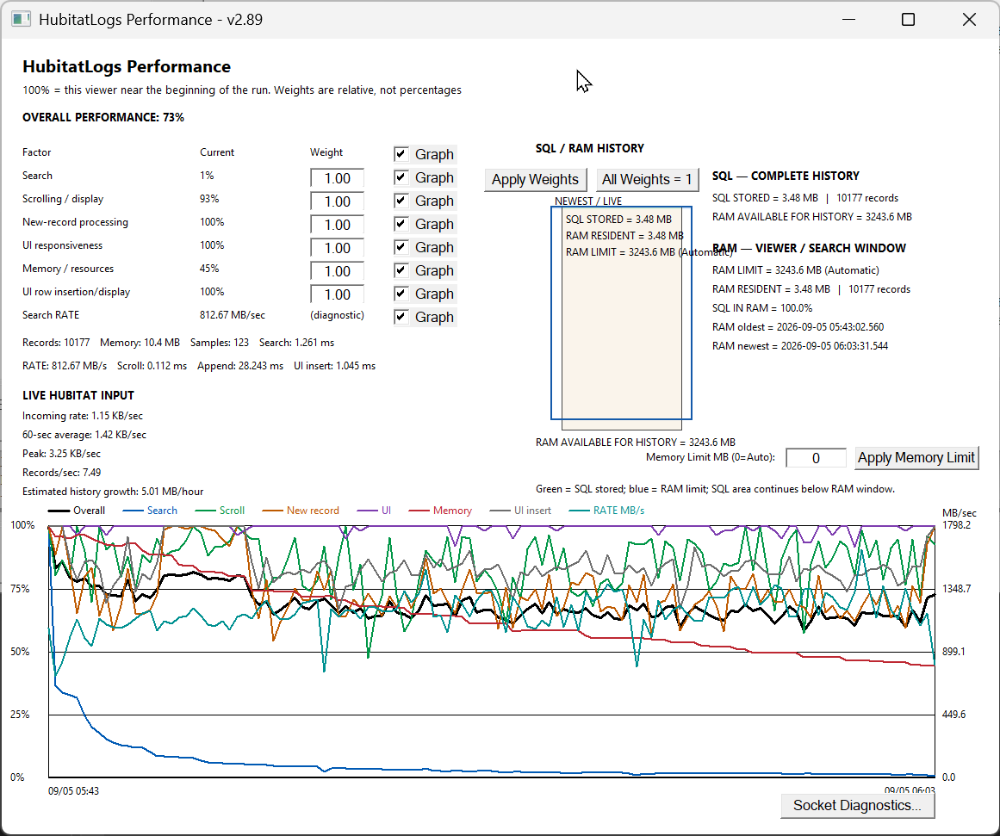

# HubitatLogs

### A Windows Log and Event Viewer for Hubitat Elevation

**HubitatLogs** is a Windows application for viewing, searching, filtering, recording, and analyzing the real-time **Logs and Events** produced by a Hubitat Elevation hub.

It was created for Hubitat users and developers who need considerably more history and flexibility than is practical with a browser-based live log display.

HubitatLogs connects directly to the Hubitat WebSocket interfaces and continuously collects Logs and Events on the Windows PC.

### Current Version: **2.89**

**Windows 10 / Windows 11**

**HubitatLogs is free for personal, non-commercial use.**

## Live Logs

HubitatLogs continuously displays logging information received from the Hubitat hub. The viewer automatically identifies the applications and devices producing log records. Individual applications or devices can be selected so that the display contains only the information of interest.

The viewer can remain running for extended periods while HubitatLogs maintains the complete collected history in its local SQL database.

## Live Events

HubitatLogs can independently monitor the Hubitat **Events** WebSocket. Events contain structured device information including device ID, attribute name, value, unit, time and description. Logs and Events can be viewed simultaneously in separate windows.

## Historical Logs and Events

HubitatLogs is not limited to information currently visible on the screen. Collected information can be saved and subsequently opened using the **Past Logs** and **Past Events** viewers.

Large historical files can be loaded and examined using the same filtering, searching and scrolling facilities used with live information. This makes it possible to investigate Hubitat activity long after the event occurred instead of having to reproduce a problem while watching a live display.

## Complete History with Controlled Memory Usage

One of the important design goals of HubitatLogs is the ability to collect a large amount of Hubitat information without requiring the entire history to remain in RAM.

HubitatLogs uses two levels of storage:

### SQL — Complete History

Every received record is stored in a local SQL database. The SQL database is the authoritative history for the current HubitatLogs session.

### RAM — Viewer / Search Window

Only a portion of that complete history needs to reside in RAM at one time. As you move through a large history, HubitatLogs automatically moves the RAM window through the SQL history.

Removing an old record from the RAM window **does not remove it from the SQL history**. This allows HubitatLogs to retain a very large history while keeping memory usage bounded.

The Memory Limit can be selected manually or left at **0 (Automatic)** so HubitatLogs determines an appropriate limit from the available system memory.

## STATS+

The STATS+ display provides detailed information about HubitatLogs performance and resource usage, including application, search, scrolling/display, new-record, UI and memory/resource performance; incoming and average data rates; peak data rate; records per second; estimated history growth; SQL history size; RAM resident history; and the RAM history limit.

The SQL/RAM display provides a visual representation of the relationship between the complete SQL history and the portion currently resident in RAM.

## Searching

HubitatLogs can search the **complete SQL history**, not merely the records currently resident in the RAM viewing window. A matching record can therefore be found even when it is far outside the portion of history currently displayed. **Clear Search** returns the viewer to its normal current-history display.

## Filtering

HubitatLogs provides several ways to reduce a large stream of Hubitat information to just the records needed for an investigation. Applications and devices are automatically identified from the incoming data and displayed in the selection panel.

You can display all logging, a single application or device, or multiple selected applications and devices. Filtering lets you concentrate on a particular problem without stopping collection of the complete underlying history.

## Designed for Long-Running Hubitat Diagnostics

Many home-automation problems are intermittent. A device may fail once every several hours, an automation may behave incorrectly only under a particular sequence of events, or a network problem may disappear before there is time to open a browser and examine it.

HubitatLogs is designed for this type of investigation. It can remain connected to the Hubitat hub while continuously collecting information on the PC. When something interesting happens, the previously collected history is already available for examination.

## Connection Monitoring and Recovery

HubitatLogs monitors its connection with the Hubitat hub. The application includes connection/recovery facilities intended to allow logging to continue through temporary network interruptions or Hubitat restarts.

## Multiple Hubitat Hubs

HubitatLogs configuration support allows different Hubitat hubs to be identified independently. Multiple configurations can be maintained, making HubitatLogs useful in installations containing more than one Hubitat Elevation hub.

## Saving and Exporting Information

Collected information can be saved for later examination. HubitatLogs supports its archived Logs and Events formats as well as CSV output for information that needs to be examined with other applications.

## Configuration

HubitatLogs can be started using a saved configuration or configured interactively. Configuration identifies the Hubitat hub and determines whether HubitatLogs starts with Live Logs, Live Events, Past Logs, or Past Events.

## Built-In Help

HubitatLogs includes extensive built-in documentation accessible through **STARTUP & HELP**. The Help system covers normal operation, configuration, searching, STATS+, memory management, historical files and other application facilities.

# Download HubitatLogs

## Latest Release — **HubitatLogs v2.89**

The current compiled Windows version is available from the **Releases** section of this repository.

**Recommended download:** `HubitatLogs-v2.89-Windows.zip`

No HubitatLogs source code is distributed in this repository.

> **Important:** GitHub automatically displays links named **Source code (zip)** and **Source code (tar.gz)** for releases. These are GitHub-generated archives of this public repository. They are **not the HubitatLogs application source code**. To install HubitatLogs, download **HubitatLogs-v2.89-Windows.zip** from the release assets.

# Installation

1. Download the latest `HubitatLogs-vX.XX-Windows.zip` from **Releases**.
2. Extract the ZIP file to a directory on the Windows PC.
3. Run `HubitatLogs.exe`.
4. Enter the Hubitat hub's IP address when configuring the program.
5. Save the configuration if you want HubitatLogs to use it automatically the next time it starts.

Additional configuration information is available from the built-in Help.

# System Requirements

- Microsoft Windows 10 or Windows 11
- Network access between the Windows PC and Hubitat Elevation hub
- A Hubitat Elevation hub

HubitatLogs runs on the Windows PC; it does not install an application or driver on the Hubitat hub simply to provide the viewer.

# Future Development

HubitatLogs continues to be actively developed. Possible future additions include expanded historical-data analysis and graphing capabilities based on the Events information already collected by HubitatLogs.

The built-in Help contains a **Future Improvements / Additions** section describing some of these ideas.

# License

**Copyright © 2026 William Siggson. All rights reserved.**

HubitatLogs is provided free of charge for personal, non-commercial use. The HubitatLogs executable and accompanying documentation may be used for personal, non-commercial purposes.

Modification, reverse engineering, or commercial distribution is not permitted without written permission from the author.

# Disclaimer

HubitatLogs is an independent third-party application. It is **not affiliated with, endorsed by, sponsored by, or supported by Hubitat, Inc.** Hubitat and Hubitat Elevation are trademarks of their respective owner.

HubitatLogs is provided without warranty. Users are responsible for determining its suitability for their systems and applications.
